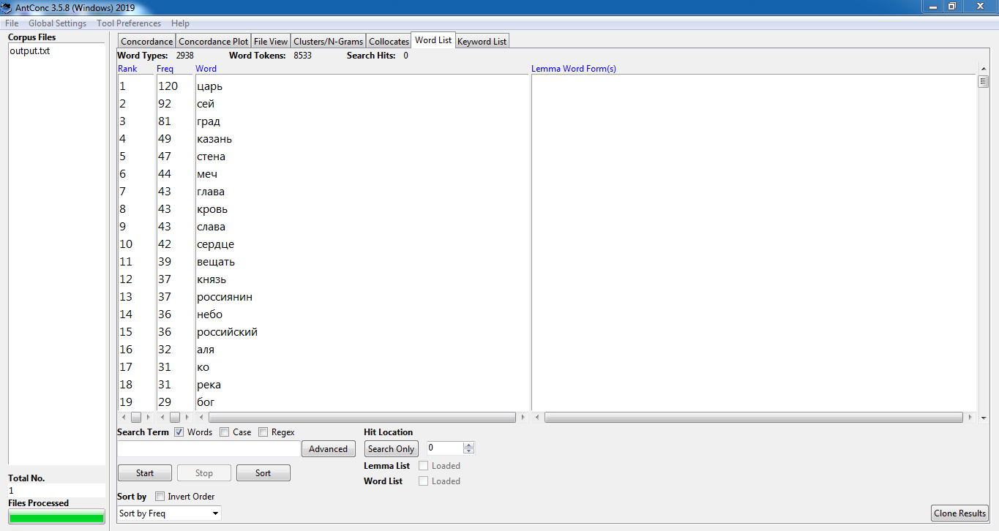
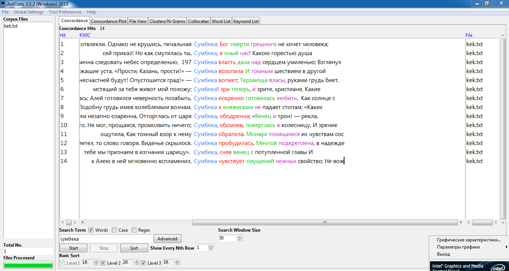
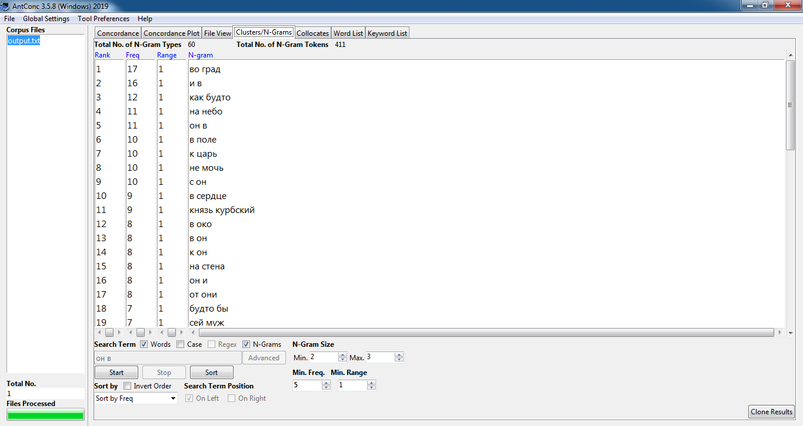
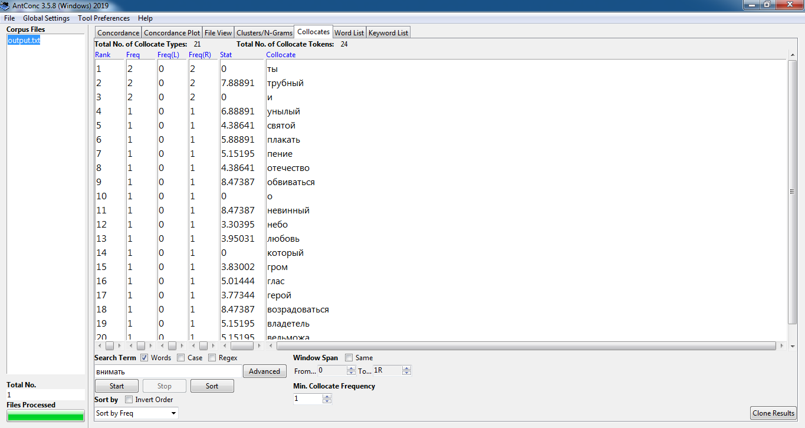
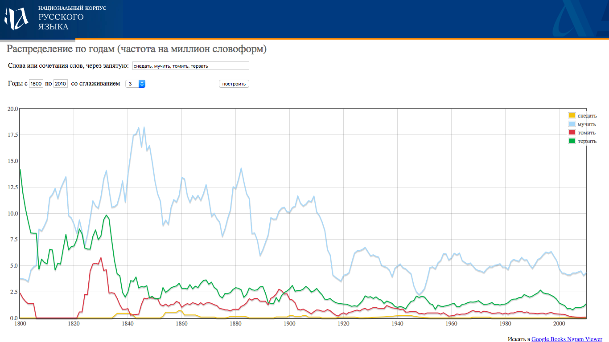
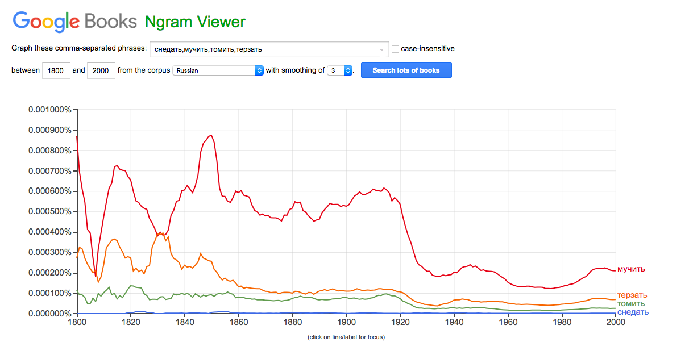
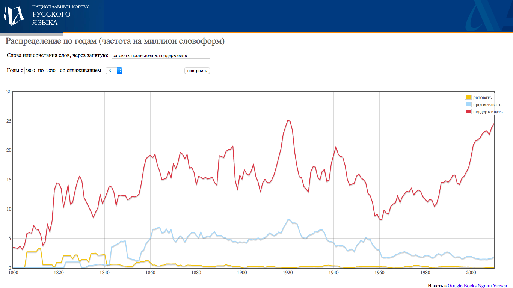
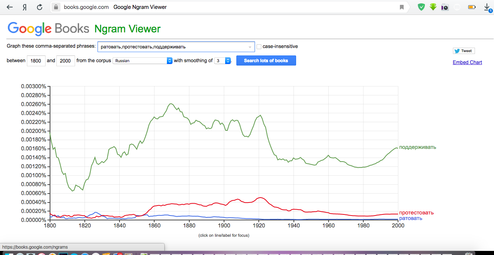
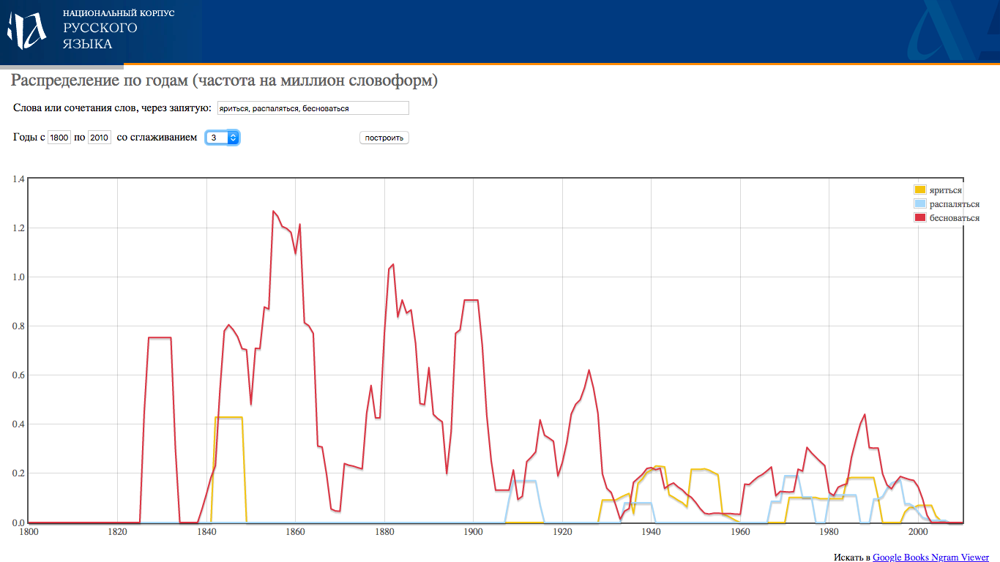
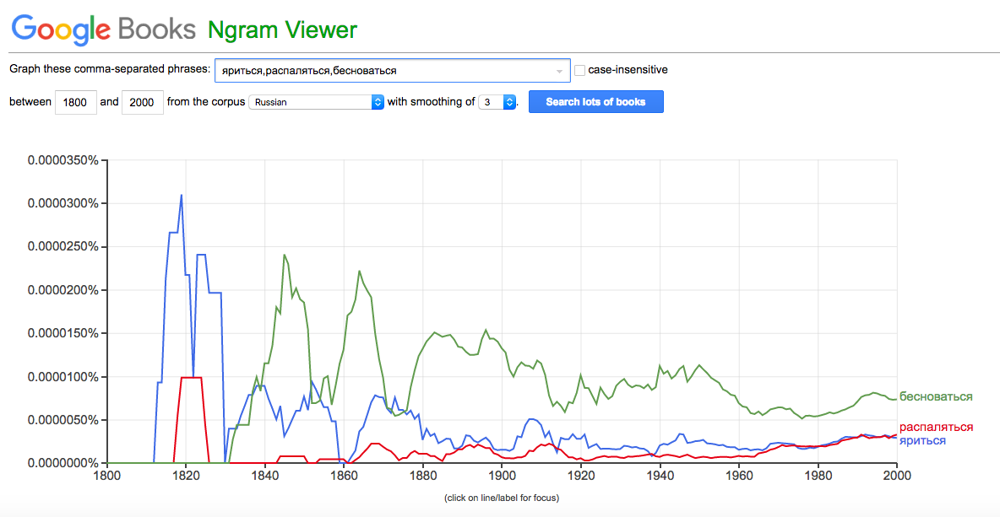

# HW3

# Часть 1

1)

2)

3)

4)

# Часть 2

Итак, из моего фрагмента текста я взяла слова "снедать", "ратовать" и "яриться".

* Как мы видим, наиболее популярный синоним для *снедать* согласно обоим корпусам -- это *мучить*. Однако, если Google утверждает его превосходство на протяжении всего времени, то НКРЯ показывает, что в начале 19 века гораздо большей популярностью пользовался глагол *терзать*, который, кстати, в обоих рейтингах занимает почетное второе место. Что же касается самого глагола *снедать*, то он вообще оказывается не очень употребительным что в 19, что в 20 веках и проигрывает еще одному своему синониму *томить*. Google и НКРЯ отмечают небольшие всплески его использования во второй половине 19 века, Национальный корпус, будучи более точным инструментом для работы с русским языком, указывает на небольшой скачок в употреблении глагола в середине 20 века.

* Прежде всего, интересно отметить, что глагол *ратовать* из-за изменения словоупотребления имеет синонимы с противоположными значениями: в своем первоначальном, более древнем смысле *ратовать* -- от *рати*, ополчаться, восставать, протестовать, в более современном и знакомом нам значении -- отстаивать, пропагандировать, поддерживать. Оба ресурса демонстрируют безусловное превосходство глагола *поддержать* среди синонимов. Google показывает схожесть позиций *ратовать* и *протестовать* в 19 веке, а затем рост употребления глагола *протестовать* и спад у *ратовать*. НКРЯ же уточняет, что в первой половине 19 века глагол *протестовать* почти не появлялся, а вот *ратовать* использовался вполне активно.

* Интересная ситуация с использованием глаголов *яриться*, *бесноваться* и *распаляться*. Google Ngrams запечатлевает скачок высокой популярности *яриться* в первой четверти 19 века, после чего в употребление входит глагол *бесноваться* и затем уже он занимает лидирующую позицию на всем временном отрезке. Глагол *яриться* оказывается относительно популярным до конца 19 века, а к концу 20 века он сравнивается по частоте использования со своим наименее популярным синонимом *распаляться*. По данным НКРЯ ситуация выглядит несколько иначе: самым популярным изначально оказывается глагол *бесноваться*, небольшой подъем популярности *яриться* приходится на середину 19 века, после чего *яриться* вновь появляется лишь в 1930ые годы и в целом уравнивает позиции с двумя остальными синонимами, оказавшись не очень часто используемыми глаголами. *Распаляться* же, как сообщает НКРЯ, появляется лишь в 20 веке и достаточно редко ипользуется с небольшими скачками употребления.
